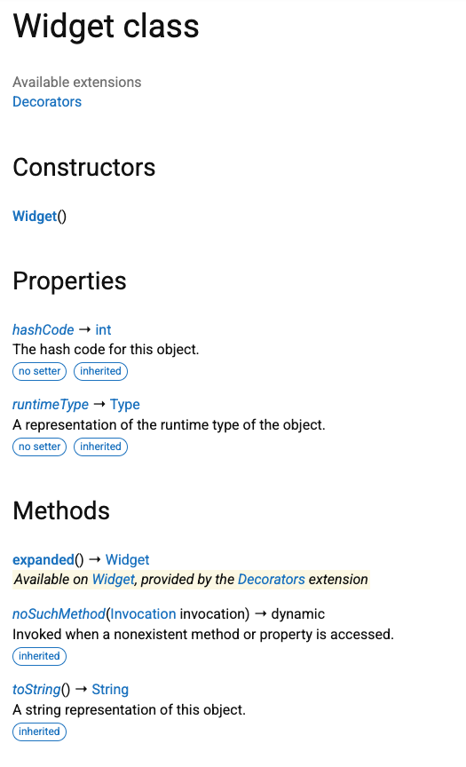

# Summary
If a static extension is on `T?`, dart doc will not include it on `T`’s API reference.

# Repro

This library has two static extensions on the `Widget` class:

```dart
class Widget {}

extension NullableDecorators on Widget? {
  Widget padding() => Widget();
}

extension Decorators on Widget {
  Widget expanded() => Widget();
}
```

# Expected result

`dart doc` includes both the `.padding` and `.expanded` decorators on the
`Widget` class.

# Actual result

The `.padding` decorator is missing:


